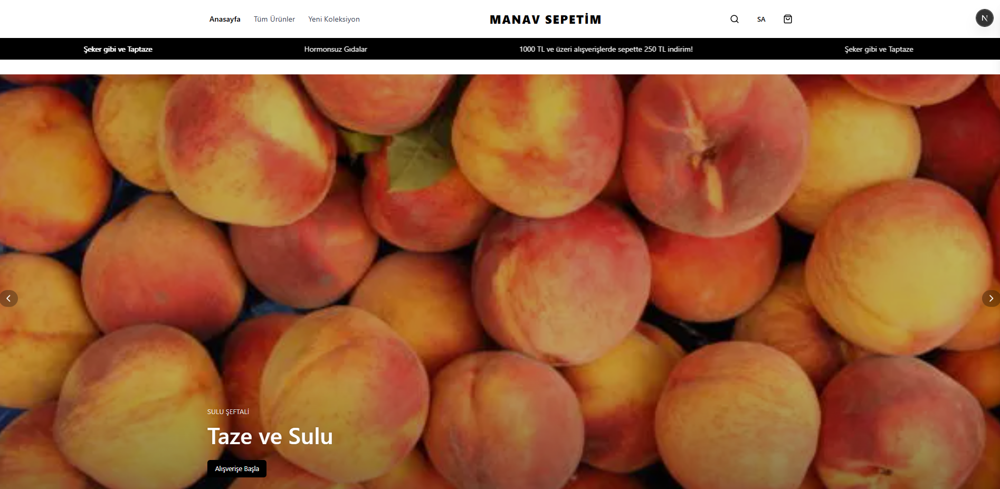
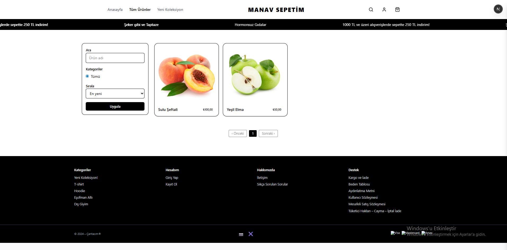
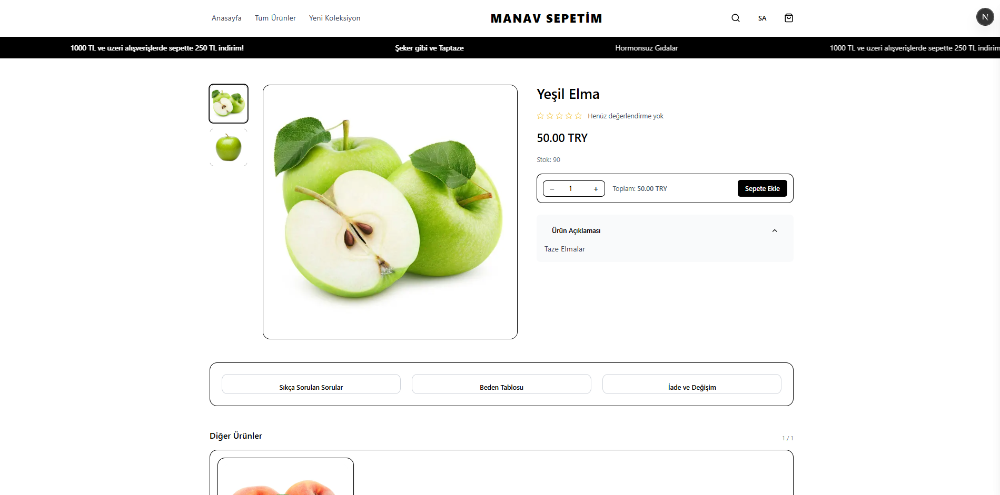
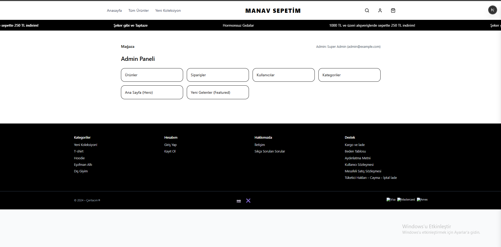

# 🛒 E-Commerce Web Application

A full-stack e-commerce platform built with Next.js and Prisma.

---

## 🚀 Features
- Admin panel for managing products, categories, and orders
- User authentication system (JWT-based)
- Product listing, filtering, and sorting
- Responsive and modern UI
- PostgreSQL database integration
- Dockerized setup for easy deployment

---

## 🛠 Tech Stack
- Frontend: Next.js, React, Tailwind CSS
- Backend: Node.js
- Database: PostgreSQL (Prisma ORM)
- Other: Docker, JWT Authentication

---

## 📸 Screenshots   

### 🏠 Homepage


### 🛍️ Product Listing


### 📦 Product Detail


### ⚙️ Admin Panel


---

## 🐳 Docker Setup

Run the project using Docker:

```bash
docker-compose up

```
---

## ⚙️ Installation (Local)
- pnpm install
- pnpm dev

---

## 🔐 Environment Variables

- Create a .env file and add your own configuration:

- DATABASE_URL=your_database_url
- JWT_SECRET=your_secret_key

---

## 📌 Status

- This project is actively being improved and expanded.

---

## 👨‍💻 Author

Göktuğ Berke Karataş  
Computer Engineering Student | Full-Stack & AI Developer  

🔗 LinkedIn: https://www.linkedin.com/in/g%C3%B6ktu%C4%9F-berke-karata%C5%9F-88ba113b9/

💻 GitHub: https://github.com/goktugbk

---

##⭐ Support
If you like this project, give it a ⭐ on GitHub!
